<p align="center">
  
</p>

<p align="center">
  <em>Your body is talking all the time. Inward helps you hear it, and find the words for what it says.</em>
</p>

<p align="center">
  
  
  
  
  
  
</p>

---

## 🫀 Close your eyes for a second

Can you feel your heartbeat right now, without touching your wrist?

Is your stomach quiet, or busy? Are your shoulders up near your ears? Is that tightness in your chest _nerves_, or _excitement_, or just the coffee?

For a lot of people these questions are hard. The signals are there, but they come through muffled, scrambled, or as one big wordless "something's wrong." That's normal. There is a sense for this, called **interoception**, and like any sense it can be trained.

**Inward is a small, calm gym for that sense.** You get short guided exercises, a growing vocabulary for what you feel, and a slow, private record of getting better at listening.

<p align="center">
  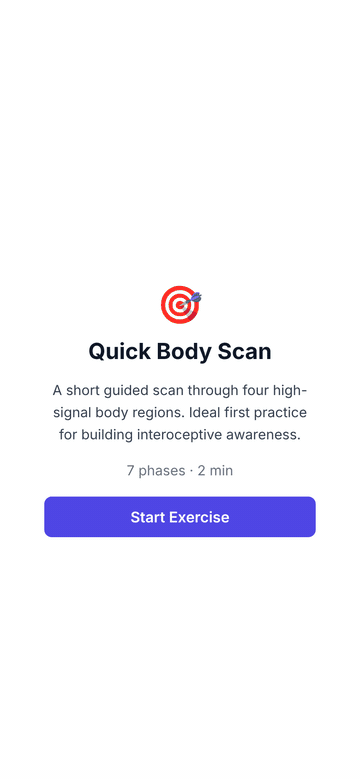
  <br />
  <sub>A full <strong>Quick Body Scan</strong>: notice → describe → connect → discover words → done.</sub>
</p>

---

## ✨ What's inside

<table>
  <tr>
    <td width="33%" align="center">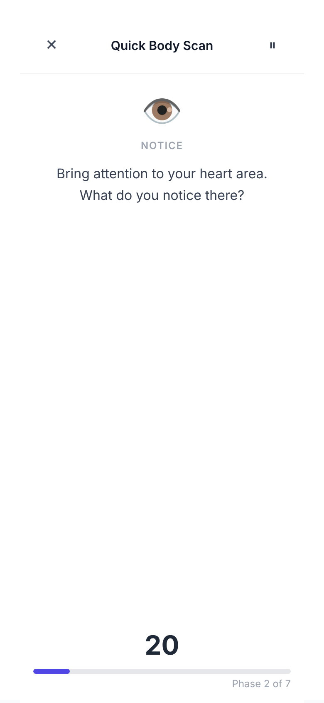</td>
    <td width="33%" align="center">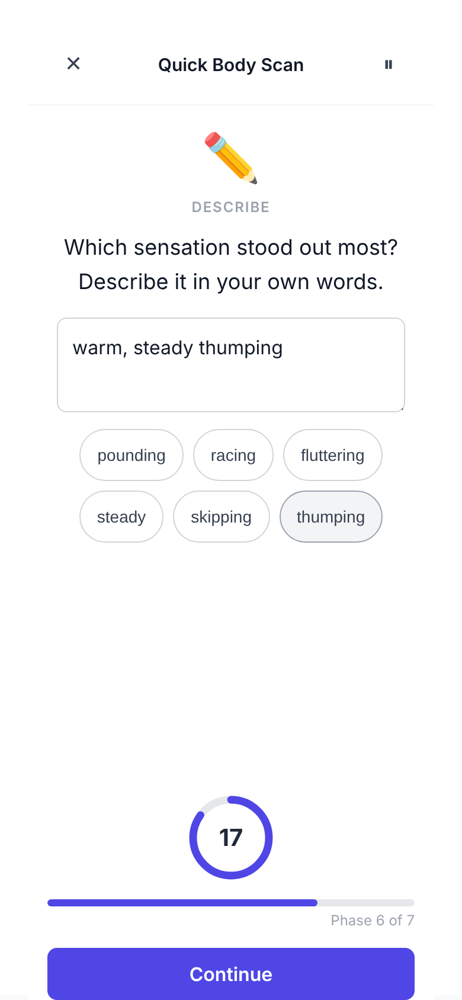</td>
    <td width="33%" align="center">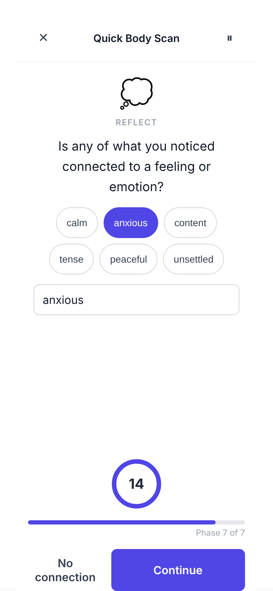</td>
  </tr>
  <tr>
    <td align="center"><strong>Notice</strong><br /><sub>Low-stimulation screens. One body region, one instruction, a quiet timer.</sub></td>
    <td align="center"><strong>Describe</strong><br /><sub>Put it in <em>your</em> words, with gentle suggestions if you get stuck.</sub></td>
    <td align="center"><strong>Connect</strong><br /><sub>Is the sensation linked to a feeling? "No connection" is a valid answer.</sub></td>
  </tr>
</table>

### 🧘 18 guided exercises

There are six families of practice, each with beginner, intermediate and advanced levels:

| Family                     | What you train                                                        |
| -------------------------- | --------------------------------------------------------------------- |
| 🫧 **Body scan**           | Sweeping attention through the body, region by region                 |
| 🎯 **Focused attention**   | Staying with one spot (hands, stomach, jaw) and noticing what's there |
| 🏃 **Movement integrated** | Move first, _then_ notice. Movement turns up the signal               |
| ❤️ **Heartbeat detection** | From "find your pulse" to sensing a resting heartbeat                 |
| 🌬️ **Breath awareness**    | Breath in the lungs, the throat, the belly                            |
| 🌡️ **Thermal awareness**   | Warmth and coolness in the hands, face and back                       |

Each exercise is a sequence of short phases (_instruction, movement, rest, notice, describe, reflect_) covering **16 body regions** from forehead to feet. They take 1½ to 3 minutes each, short enough to do daily.

### 📖 A vocabulary that grows with you

<table>
  <tr>
    <td width="50%" align="center">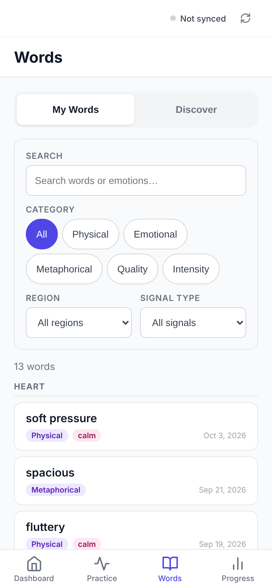</td>
    <td width="50%" align="center">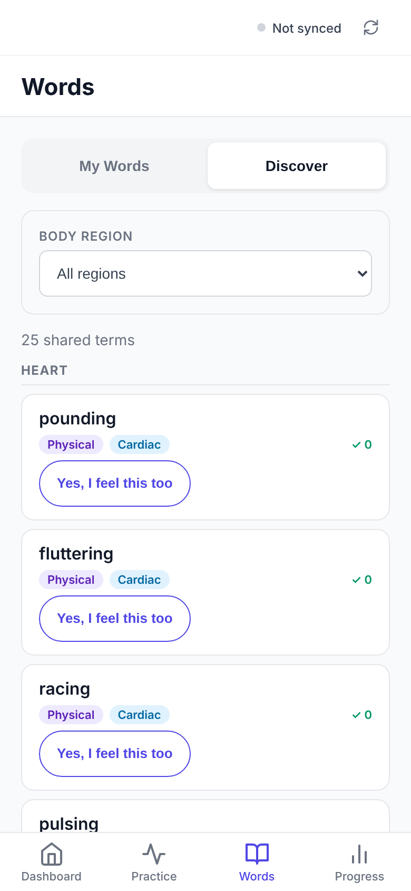</td>
  </tr>
  <tr>
    <td align="center"><strong>My Words</strong><br /><sub>Everything you've described, grouped by body region and searchable.</sub></td>
    <td align="center"><strong>Discover</strong><br /><sub>Words other people use. Tap <em>"Yes, I feel this too"</em> when one fits.</sub></td>
  </tr>
</table>

Many people say _"I didn't know there was a word for that"_ the first time they see **butterflies**, **lump in the throat** or **hollow**. Inward starts with 25 seed terms (physical, metaphorical, quality, intensity) and every description you write is added to your own list.

### 📈 Progress you can actually see

<table>
  <tr>
    <td width="25%" align="center">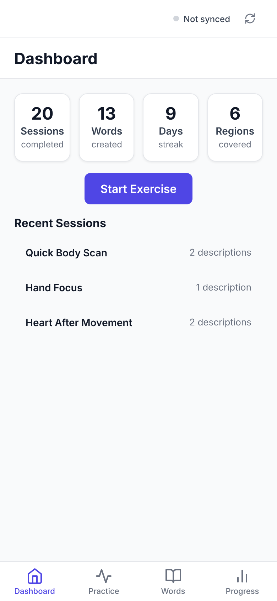</td>
    <td width="25%" align="center">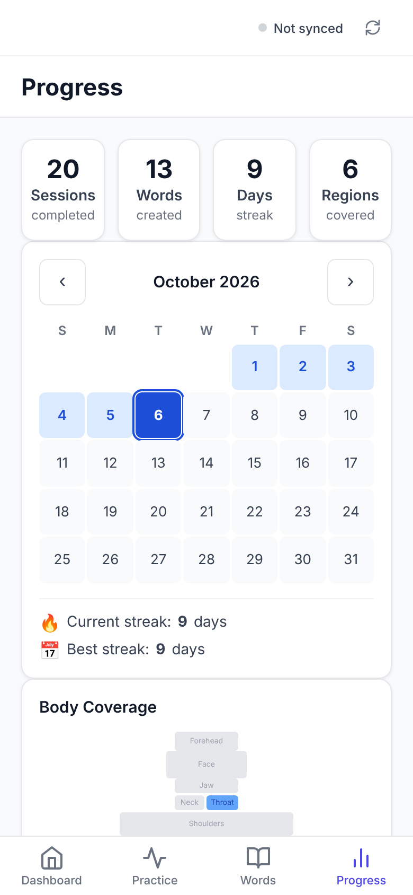</td>
    <td width="25%" align="center">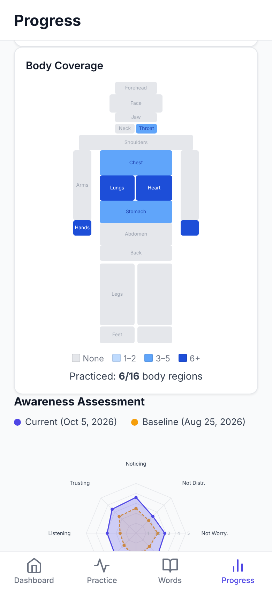</td>
    <td width="25%" align="center">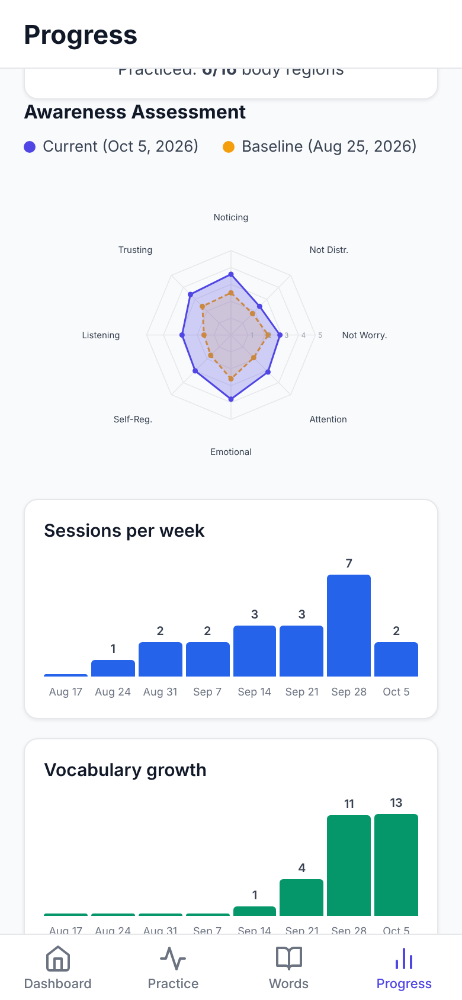</td>
  </tr>
  <tr>
    <td align="center"><sub><strong>Dashboard</strong><br />sessions · words · streak · regions</sub></td>
    <td align="center"><sub><strong>Streak calendar</strong><br />small daily practice adds up</sub></td>
    <td align="center"><sub><strong>Body map</strong><br />which regions you've explored</sub></td>
    <td align="center"><sub><strong>MAIA-2 radar</strong><br />baseline vs. now, 8 subscales</sub></td>
  </tr>
</table>

Progress is measured with the **MAIA-2** (Multidimensional Assessment of Interoceptive Awareness, v2), the standard 37-question research questionnaire. It's optional and you can take it during onboarding. Retake it in a few weeks and the radar chart shows how you've changed. Trend charts and gentle insights fill in the rest (_"9-day streak!"_, _"Awareness growing!"_).

### 🔒 Private by default

- **Local-first.** Everything lives in IndexedDB on your device. There are no accounts and no analytics.
- **Works offline.** It's an installable PWA, so it works on a plane, in a waiting room, or in bed at 3am.
- **Your data, your call.** Export everything as JSON or delete it all with one tap.
- **Sync is opt-in.** Syncing shared vocabulary needs explicit consent and uses an anonymous, resettable device ID.

---

## 📜 A short history of feeling your insides

People have argued about whether we feel emotions in the body or the head for over a century.

| Year  | Moment                                                                                                                                                                                                                                                                                                 |
| ----- | ------------------------------------------------------------------------------------------------------------------------------------------------------------------------------------------------------------------------------------------------------------------------------------------------------ |
| 1884  | **William James** asks _"What is an emotion?"_ and gives a surprising answer: we don't cry because we're sad, we feel sad because we notice ourselves crying. Emotion, he argues, _is_ the perception of the body changing.                                                                            |
| 1906  | Physiologist **Charles Sherrington** sorts the senses into three: _exteroception_ (the outside world), _proprioception_ (where your limbs are) and **_interoception_**, the signals from inside: gut, heart, lungs. The sense finally has a name.                                                      |
| 1920s | **Walter Cannon** pushes back on James: organs are too slow and too vague to be the source of feelings. The argument over how much the body shapes emotion runs for decades.                                                                                                                           |
| 1973  | Psychiatrist **Peter Sifneos** coins **alexithymia**, Greek for _"no words for emotions"_, after noticing patients who felt _something_ intensely but couldn't name it.                                                                                                                                |
| 1981  | **Rainer Schandry** publishes the heartbeat counting task: sit still, count your heartbeats, compare with an ECG. For the first time interoception can be _measured_, and people turn out to vary enormously.                                                                                          |
| 1994  | **Antonio Damasio**'s _Descartes' Error_ brings back the body with the somatic marker hypothesis: bodily feelings steer our decisions long before conscious reasoning catches up.                                                                                                                      |
| 2002  | **A.D. (Bud) Craig** maps a pathway from the body's tissues up to the **insula**, a fold of cortex that builds a running picture of "how I feel right now."                                                                                                                                            |
| 2004  | **Hugo Critchley** and colleagues show that people who are better at sensing their heartbeat have more activity in the right anterior insula, and tend to report stronger emotional experience.                                                                                                        |
| 2012  | **Wolf Mehling** and colleagues release the **MAIA**, a questionnaire for the many sides of body awareness: noticing, not-worrying, trusting, self-regulating. Version 2 (2018) is what Inward uses.                                                                                                   |
| 2015  | **Sarah Garfinkel** and colleagues separate interoception into three things: **accuracy** (can you detect it?), **sensibility** (do you _think_ you can?) and **awareness** (do you know how good you are?). The gaps between them turn out to matter, especially for anxiety.                         |
| 2020s | Garfinkel's group runs the **ADIE** randomised trial: a few weeks of heartbeat-awareness training reduces anxiety in autistic adults. The idea that _interoception is trainable_ becomes evidence. Occupational therapists such as **Kelly Mahler** bring "the eighth sense" into schools and clinics. |

Today interoceptive differences are linked to **anxiety, autism, ADHD, alexithymia, eating disorders, and trauma/PTSD**. That's a lot of people living with a muffled inner signal. Inward takes the methods from the lab (single-region focus, movement to amplify signals, non-judgmental noticing, building your own vocabulary, short frequent practice, strong signals before subtle ones) and puts them in your pocket.

> Want the deep dive? [`docs/INTEROCEPTION-RESEARCH.md`](docs/INTEROCEPTION-RESEARCH.md) covers the research, measurement methods, clinical populations and references.

---

## 🧭 The training loop

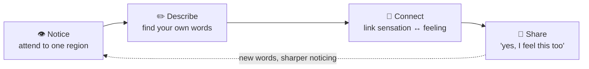

1. **Notice.** Guided attention to one specific place in the body.
2. **Describe.** Name what's there in your own language. Nothing is wrong.
3. **Connect.** Is it linked to an emotion? Sometimes yes, sometimes it's just your stomach.
4. **Share.** Others' words help you describe what you couldn't before, and your confirmations help them.

---

## 🛠️ Run it locally

```bash
git clone https://github.com/chrisbrooksbank/inward.git
cd inward
npm install
npm run dev        # → http://localhost:5173
```

| Command                 | What it does                                              |
| ----------------------- | --------------------------------------------------------- |
| `npm run dev`           | Start the SvelteKit dev server                            |
| `npm run build`         | Production build (static site, ready for Netlify)         |
| `npm run preview`       | Preview the production build                              |
| `npm run test:run`      | Run unit tests once (Vitest + fake-indexeddb)             |
| `npm run test:coverage` | Coverage report (80% threshold)                           |
| `npm run test:e2e`      | Playwright end-to-end tests                               |
| `npm run check`         | **Everything**: typecheck, lint, format, knip, unit tests |

### Under the hood

- **SvelteKit + Svelte 5 runes** for small, fast, reactive UI
- **TypeScript (strict) + Zod** for types you can trust at runtime too
- **IndexedDB via `idb`** for local-first persistence
- **`@vite-pwa/sveltekit`** for offline support and installability
- **Vitest + Playwright** for unit and E2E tests, with strict ESLint guardrails (low complexity, small functions, no `any`)

```
src/
├── routes/
│   ├── (onboarding)/   # 6-step welcome flow + optional MAIA-2 baseline
│   ├── (app)/          # dashboard · exercises · vocabulary · progress
│   └── (exercise)/     # the distraction-free exercise player
└── lib/
    ├── core/           # exercises, MAIA-2 scoring, vocabulary, sync, offline queue
    ├── stores/         # player state machine + IndexedDB-backed stores
    ├── components/     # timer, radar chart, body map, streak calendar…
    ├── db/             # IndexedDB schema & operations
    └── types/          # Zod domain + sync schemas
```

Design docs live in [`docs/`](docs): [exercise system](docs/EXERCISE-SYSTEM.md), [player UI](docs/EXERCISE-PLAYER-UI.md), [vocabulary](docs/SENSATION-VOCABULARY.md), [progress](docs/PROGRESS-DASHBOARD.md), [onboarding](docs/ONBOARDING-FLOW.md), [sync protocol](docs/P2P-SYNC-PROTOCOL.md), [navigation](docs/APP-NAVIGATION.md) and [accessibility](docs/ACCESSIBILITY.md).

---

## 💜 A note on who this is for

If you've ever been asked _"how are you feeling?"_ and gone blank. If your body seems to shout or whisper but never quite _speak_. If you're autistic, anxious, ADHD, recovering from something, or just curious. This is for you.

Inward is a training tool, not a medical device. It isn't a substitute for professional care, but it can be a gentle companion alongside it.

<p align="center">
  
  <br />
  <sub>Made with care · <a href="LICENSE">MIT licensed</a> · breathe out 🌬️</sub>
</p>
